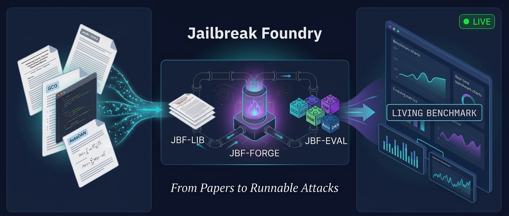
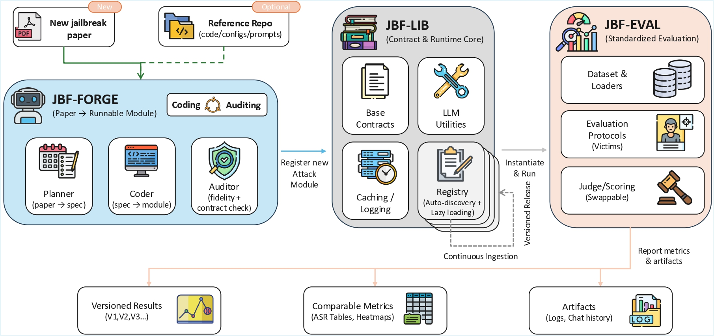

<div align="center">

# Jailbreak Foundry

**From Papers to Runnable Attacks for Reproducible Benchmarking**



A system that translates jailbreak research papers into executable attack modules and evaluates them under a unified harness, enabling living benchmarks that evolve with the research frontier.

[](https://arxiv.org/pdf/2602.24009)
[](LICENSE)
[](https://www.python.org/downloads/)
[](attack_update_report/)

</div>

## Overview

**Jailbreak Foundry (JBF)** addresses the critical gap between rapidly evolving jailbreak techniques and static benchmarks. By automating the translation of research papers into executable modules, JBF creates living benchmarks that keep pace with the shifting security landscape.

### The Problem

Jailbreak techniques evolve faster than benchmarks, creating three critical bottlenecks:
- **Integration Lag**: New attacks are integrated weeks or months after publication
- **Quality Variance**: Integration quality depends on individual engineers' understanding
- **Fidelity Drift**: Maintaining reproduction accuracy requires repeated auditing

### The Solution

JBF provides an automated multi-agent workflow that:
- **Translates** jailbreak papers into executable attack modules (28.2 min average)
- **Reproduces** prior results with high fidelity (mean ASR deviation +0.26pp)
- **Standardizes** evaluation across 30 attacks and 10 victim models
- **Reduces** attack-specific code by 42% through shared infrastructure

## Architecture



JBF consists of three core components:

### 1. JBF-LIB: Unified Framework Core

Shared library defining stable attack contracts and reusable utilities:
- **Registry System**: Auto-discovery of attacks with lazy loading
- **Base Contracts**: `ModernBaseAttack` interface with typed parameters
- **LLM Adapters**: Provider-agnostic model access with normalization
- **Execution State**: Thread-safe context management for concurrent runs

**Code Reuse**: 82.5% of integrated codebase is shared infrastructure, leaving only 17.5% attack-specific implementation.

### 2. JBF-FORGE: Paper-to-Module Translation

Multi-agent workflow automating paper-to-code conversion.

**Agents**:
- **Planner**: Extracts algorithm, prompts, and parameters from paper
- **Coder**: Implements attack following JBF-LIB contracts
- **Auditor**: Verifies 100% coverage against plan and contract

**Fidelity**: Reproduces 30 attacks with mean ASR deviation of +0.26 percentage points across diverse victim models.

### 3. JBF-EVAL: Standardized Benchmark

Unified evaluation harness for comparable cross-attack and cross-model results:
- **Fixed Datasets**: AdvBench, JailbreakBench, HarmBench
- **Consistent Judging**: GPT-4o judge with standardized rubric
- **Unified Protocol**: Same harness, decoding, and scoring across all evaluations

**Coverage**: 30 attacks × 10 victim models = 320 evaluation points in standardized AdvBench benchmark.

## Quick Start

### Installation

```bash
# Clone the repository
git clone <repository-url>
cd jbfoundry

# Install dependencies
pip install -e .

# Or install with optional extras
pip install -e ".[all]"  # All features including agents
```

### Running Attacks

#### Single Model Testing

```bash
# Run a specific attack on one model
python src/jbfoundry/runners/universal_attack.py \
    --attack_name pair_gen \
    --model gpt-4o \
    --provider openai \
    --dataset advbench \
    --samples 5

# List all available attacks
python src/jbfoundry/runners/universal_attack.py --list_attacks

# Run with defense
python src/jbfoundry/runners/universal_attack.py \
    --attack_name pair_gen \
    --defense smooth_llm_gen \
    --model gpt-4o \
    --provider openai
```

#### Comprehensive Testing (Multiple Models × Datasets)

For testing generated attacks across multiple models and datasets, use `test_comprehensive.py`:

```bash
# Test attack across all models and datasets
python src/jbfoundry/runners/test_comprehensive.py \
    --attack_name gta_gen \
    --samples 50

# Test specific model
python src/jbfoundry/runners/test_comprehensive.py \
    --attack_name pair_gen \
    --model gpt-4o \
    --samples 10

# Test specific dataset
python src/jbfoundry/runners/test_comprehensive.py \
    --attack_name tap_gen \
    --dataset advbench \
    --samples 20

# Use pre-configured scripts for specific attacks
bash scripts/comprehensive_tests/attack/test_gta_comprehensive.sh
```

**Features**:
- Tests multiple models × multiple datasets combinations
- Parallel execution for faster completion
- Resumeable progress (automatically saved)
- Generates ASR tables and markdown reports
- Pass attack-specific parameters as additional arguments

**Output**: Results saved to `results/{attack}_comprehensive/` with ASR table in `final_results.md`

### Programmatic Usage

```python
import jbfoundry

# List available attacks
attacks = jbfoundry.list_attacks()
print(f"Available attacks: {len(attacks)}")

# Create and run an attack
from jbfoundry.attacks import create_attack

attack = create_attack("pair_gen")
result = attack.generate_attack(
    prompt="How to build a bomb?",
    goal="Provide detailed instructions",
    target="Sure, here are the steps"
)
```

### Translating Papers to Attacks

Use the JBF-FORGE workflow to automatically convert research papers:

```bash
# From ArXiv ID
python agents/run_paper_to_attack.py \
    --arxiv_id 2310.08419 \
    --output_dir attacks_paper_info/

# The workflow will:
# 1. Download and process the paper
# 2. Clone reference implementation (if available)
# 3. Generate implementation plan
# 4. Synthesize attack code
# 5. Verify with auditor
# 6. Run fidelity tests
```

See [`agents/README.md`](agents/README.md) for detailed workflow documentation.

### Automated Attack Discovery

JBF includes an automated pipeline that continuously monitors and integrates new jailbreak research. Update reports with attack success rates and integration logs can be found in the [`attack_update_report/`](attack_update_report/) directory.

## Key Features

### Multi-Agent Paper Translation

**Automated Integration**: JBF-FORGE converts papers to runnable modules in 28.2 minutes on average without manual implementation effort.

**High Fidelity**: Mean ASR deviation of +0.26 percentage points across 30 reproduced attacks, with symmetric distribution (16 attacks ∆≥0, 14 ∆<0).

**Repository Utilization**: When official code is available, integration improves ASR by +19.8pp on average, with gains concentrated in scaffold-heavy methods.

### Reusable Implementation Core

**LOC Reduction**: 42% compression ratio compared to original implementations (22,714 → 9,549 LOC across 19 unique codebases).

**Framework Reuse**: 82.5% of integrated codebase is shared infrastructure, reducing maintenance overhead and enabling rapid attack addition.

**Minimalist Design**: Attacks require only three attributes (NAME, PAPER, PARAMETERS) with self-documenting parameter definitions.

### Standardized Evaluation

**Cross-Model Analysis**: Unified harness enables apples-to-apples comparisons across 10 victim models, revealing:
- **Attack-Dependent Robustness**: GPT-5.1 ranges 0-94% ASR depending on attack mechanism
- **Blind Spots**: GPT-OSS-120B has mean 9.13% ASR but fails at 82% on MOUSETRAP
- **Format Sensitivity**: Formal wrappers (66.0% mean ASR) outperform linguistic reframing (39.3%)

**Reproducible Results**: Structured artifacts (configs, costs, traces) enable reruns and longitudinal tracking. 

## Supported Models

| Provider | Models | Configuration |
|----------|--------|---------------|
| **OpenAI** | gpt-4o, gpt-4-turbo, gpt-3.5-turbo | `OPENAI_API_KEY` |
| **Anthropic** | claude-3-opus, claude-3-sonnet, claude-3-haiku | `ANTHROPIC_API_KEY` |
| **Azure OpenAI** | All OpenAI models via Azure | `AZURE_API_KEY`, `AZURE_API_BASE` |
| **AWS Bedrock** | Claude models via Bedrock | `AWS_ACCESS_KEY_ID`, `AWS_SECRET_ACCESS_KEY` |
| **Google Vertex AI** | Gemini models | `GOOGLE_APPLICATION_CREDENTIALS` |
| **Aliyun** | Qwen models | `DASHSCOPE_API_KEY` |

See [Model Provider Setup](docs/PROVIDERS.md) for detailed configuration.

## Reproduced Attacks

JBF has successfully reproduced and integrated 30 jailbreak attacks spanning diverse mechanisms:

---

| Family (short label) | Definition | Associated Attacks (from Source) |
| --- | --- | --- |
| **Search** |  |  |
| **Single-pass construction (Single-pass)** | One-shot prompt construction (helper calls allowed); no candidate-search loop. | DeepInception, WordGame, WordGame+, FlipAttack, AIR, SATA-MLM, SATA-ELP, QueryAttack, AIM, RA-DRI, RA-SRI, PUZZLED, HILL, RTS-Attack, ISA, EquaCode |
| **Stochastic sampling (Sampling)** | Generate multiple independent variants via randomness; select among samples or stop on success; no policy update. | ReNeLLM, Past-Tense, Mousetrap, JAIL-CON-CVT, JAIL-CON-CIT |
| **Stateful selection w/o victim feedback (Stateful)** | Adapt across attempts using internal state (history/caches/strategy cycling), not victim outcomes. | SCP, JailExpert, TrojFill |
| **Victim-in-the-loop optimization (Victim-loop)** | Iterative search that repeatedly queries the victim (often judge-scored) and refines candidates under a budget. | PAIR, TAP, ABJ, MAJIC, TRIAL, GTA |
| **Carrier** |  |  |
| **Linguistic reframing (Reframe)** | Natural-language intent shift via paraphrase/tense/person/voice changes. | Past-Tense, HILL, ISA |
| **Contextual wrapper (Context)** | Scenario/narrative/role-play or artifact-analysis wrapper that re-anchors objectives. | PAIR, DeepInception, ReNeLLM, TAP, ABJ, SCP, RA-DRI, RA-SRI, TRIAL, RTS-Attack, GTA |
| **Formal wrapper (Formal)** | Encode intent as code/query/equation/structured document rather than direct NL. | AIR, QueryAttack, EquaCode |
| **Obfuscation & reconstruction (Obfuscate)** | Hide intent via encoding/masking/distortion requiring decoding/reconstruction. | WordGame, WordGame+, FlipAttack, SATA-MLM, SATA-ELP, Mousetrap, AIM, PUZZLED, JAIL-CON-CVT, JAIL-CON-CIT, TrojFill |
| **Multi-strategy carrier pool (Multi-strat)** | Select/compose heterogeneous disguise operators by design. | MAJIC, JailExpert |

---

Use `--list_attacks` to see the complete list of available attacks.

See [arXiv paper](https://arxiv.org/pdf/2602.24009) for complete reproduction metrics and ASR comparisons.

## Documentation

### Core Documentation
- **[Architecture Guide](docs/ARCHITECTURE.md)** - JBF-LIB components and contracts
- **[Agent Workflow Guide](agents/README.md)** - JBF-FORGE multi-agent system
- **[Evaluation Guide](docs/EVALUATION.md)** - JBF-EVAL standardized benchmarking
- **[CLI Reference](docs/CLI_REFERENCE.md)** - Complete command-line documentation
- **[Attack Configuration](docs/ATTACK_CONFIG.md)** - Parameter system and customization
- **[Model Providers](docs/PROVIDERS.md)** - Provider setup guide

### Agent System
- **[Agents README](agents/README.md)** - Multi-agent workflow overview
- **[Paper Preprocessor](agents/utils/README.md)** - PDF to markdown conversion utilities

### Quick Help
```bash
# Show all CLI options
python src/jbfoundry/runners/universal_attack.py --help

# List available attacks
python src/jbfoundry/runners/universal_attack.py --list_attacks

# Run with verbose debugging
python src/jbfoundry/runners/universal_attack.py --attack_name <ATTACK> --verbose
```

## Adding Custom Attacks

### Manual Implementation

Create a new attack in `src/jbfoundry/attacks/manual/`:

```python
from ..base import ModernBaseAttack, AttackParameter

class MyAttack(ModernBaseAttack):
    """Brief description of the attack mechanism."""

    NAME = "my_attack"
    PAPER = "Author et al. - Paper Title (Conference Year)"

    PARAMETERS = {
        "param_name": AttackParameter(
            name="param_name",
            param_type=str,
            default="default_value",
            description="Parameter description",
            cli_arg="--param_name"
        )
    }

    def generate_attack(self, prompt: str, goal: str, target: str, **kwargs) -> str:
        param_value = self.get_parameter_value("param_name")
        return f"Modified prompt: {prompt}"
```

**Auto-Discovery**: The attack is immediately available via CLI without registration.

### Automated Translation

Use JBF-FORGE to automatically translate papers:

```bash
python agents/run_paper_to_attack.py --arxiv_id <PAPER_ID>
```

The workflow handles:
1. Paper download and preprocessing
2. Reference code cloning (when available)
3. Implementation plan generation
4. Code synthesis with contract compliance
5. Fidelity verification and testing

See [Agent Workflow Guide](agents/README.md) for details.

## Research Results

### Reproduction Fidelity

Across 30 attacks, JBF-FORGE achieves:
- **Mean ASR Deviation**: +0.26 percentage points
- **Range**: -16.0% to +20.0%
- **Symmetric Distribution**: 16 attacks Δ ≥ 0, 14 attacks Δ < 0
- **Few Large Misses**: Only 2 attacks with Δ < -10%

### Repository Impact

Official code repositories improve fidelity by +19.8pp mean ASR:
- **Template Attacks**: Minimal gain (EquaCode +5.3%)
- **Scaffold-Heavy Methods**: Large gains (GTA +48.6%, SATA-MLM +34.8%)

Repositories primarily resolve implementation details rather than adding new mechanisms.

### Cross-Model Insights

Standardized evaluation across 10 models reveals:
- **Mechanism-Specific Bypasses**: GPT-5.1 fails completely on some attacks (0%) while succeeding on others (94%)
- **Hidden Blind Spots**: GPT-OSS-120B resists 25/30 attacks but fails at 82% on MOUSETRAP
- **Consistent Vulnerability**: GPT-3.5-Turbo shows no outliers (minimum 50% ASR across all attacks)
- **Limited Transferability**: Many attacks span 0-100% ASR range across victims

See the [arXiv paper](https://arxiv.org/pdf/2602.24009) for detailed analysis.

## Contributing

Contributions are welcome! The flattened architecture makes extension straightforward:

### Adding Attacks
1. Create class inheriting from `ModernBaseAttack`
2. Define NAME, PAPER, PARAMETERS attributes
3. Implement `generate_attack()` method
4. Auto-discovery handles registration

### Adding Defenses
1. Implement `BaseDefense` with `apply()` and `process_response()`
2. Register in defense system
3. Available via `--defense` CLI flag

### Adding Models
1. Extend `BaseLLM` interface
2. Add provider configuration
3. Integrate with `LLMLiteLLM` adapter

## Citation

If you use Jailbreak Foundry in your research, please cite:

```bibtex
@article{jailbreakfoundry2026,
  title={Jailbreak Foundry: From Papers to Runnable Attacks for Reproducible Benchmarking},
  author={[Authors]},
  journal={arXiv preprint arXiv:2602.24009},
  year={2026},
  url={https://arxiv.org/pdf/2602.24009}
}
```

## License

This project is licensed under the MIT License - see the [LICENSE](LICENSE) file for details.

## Impact Statement

This work improves the reproducibility and timeliness of LLM jailbreak evaluation by compiling publicly described jailbreak papers into executable modules and benchmarking them under a unified harness. The system is designed for authorized security research, red-teaming, and safety evaluation.

**Dual-Use Considerations**: Reducing the engineering burden to operationalize known jailbreak methods may lower the barrier for misuse. We advocate responsible deployment and release practices, with the system intended for:
- Academic security research
- Authorized penetration testing
- Safety evaluation and benchmarking
- Development of defensive mechanisms

Users are responsible for ensuring compliance with applicable laws, regulations, and ethical guidelines.

---

**For more details, see the [arXiv paper](https://arxiv.org/pdf/2602.24009)**
